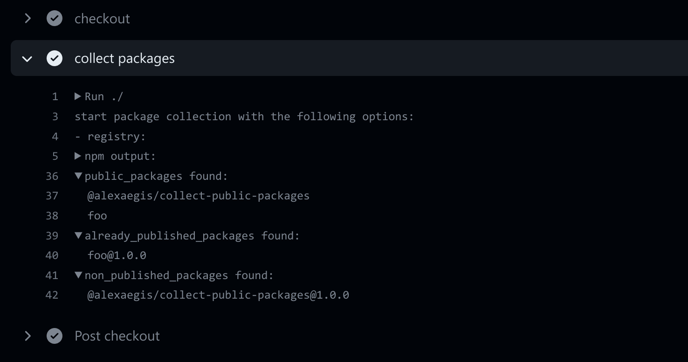
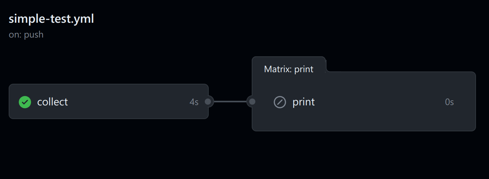

# [collect-public-packages](https://github.com/marketplace/actions/collect-public-packages)

[](https://github.com/AlexAegis/collect-public-packages/actions/workflows/cicd.yml)
[](https://app.codacy.com/gh/AlexAegis/collect-public-packages/dashboard?utm_source=gh&utm_medium=referral&utm_content=&utm_campaign=Badge_grade)
[](https://codecov.io/gh/AlexAegis/collect-public-packages)

This action scans your workspace (Based on `pnpm-workspace.yaml` and the
`workspace` propery in your `package.json` file) for packages and outputs the
name of every package where the property `private` is explicitly set to `false`.
It will then check if the package at that version exists on the `registry`, and
partitions the result based on that.



## Use

Construct a job matrix strategy to release every public package in a repository.

A job matrix would fail to construct if its array is empty. For this reason this
action only outputs non-empty arrays. If there are no public packages within the
repository it outputs nothing. This makes it trivial to use the same output as a
condition for the job.

> When there are no public packages, the job won't run because of the condition



### Example workflow

> For a real-world usecase check the workflows of this repository!

```yaml
name: simple-test

on:
  workflow_dispatch:
  push:
    branches: '**'

jobs:
  collect:
    runs-on: ubuntu-latest
    outputs:
      public_packages: ${{ steps.collect_packages.outputs.public_packages }}
      already_published_packages:
        ${{ steps.collect_packages.outputs.already_published_packages }}
      non_published_packages:
        ${{ steps.collect_packages.outputs.non_published_packages }}
    steps:
      - name: checkout
        uses: actions/checkout@v3
        with:
          fetch-depth: 1
      - name: collect packages
        id: collect_packages
        uses: AlexAegis/collect-public-packages@v2
  print:
    name: |
      print ${{ matrix.package.package_name }}@${{ matrix.package.package_version }}
    runs-on: ubuntu-latest
    if: needs.collect.outputs.public_packages
    strategy:
      matrix:
        package: ${{ fromJSON(needs.collect.outputs.public_packages) }}
    needs: [collect]
    steps:
      - name: print package data
        run: |
          echo package_name: ${{ matrix.package.package_name }}
          echo package_version: ${{ matrix.package.package_version }}
          echo package_name_without_org: ${{ matrix.package.package_name_without_org }}
          echo package_name_only_org: ${{ matrix.package.package_name_only_org }}
          echo package_path_from_root_package: ${{ matrix.package.package_path_from_root_package }}
          echo is_published: ${{ matrix.package.is_published }}
```
